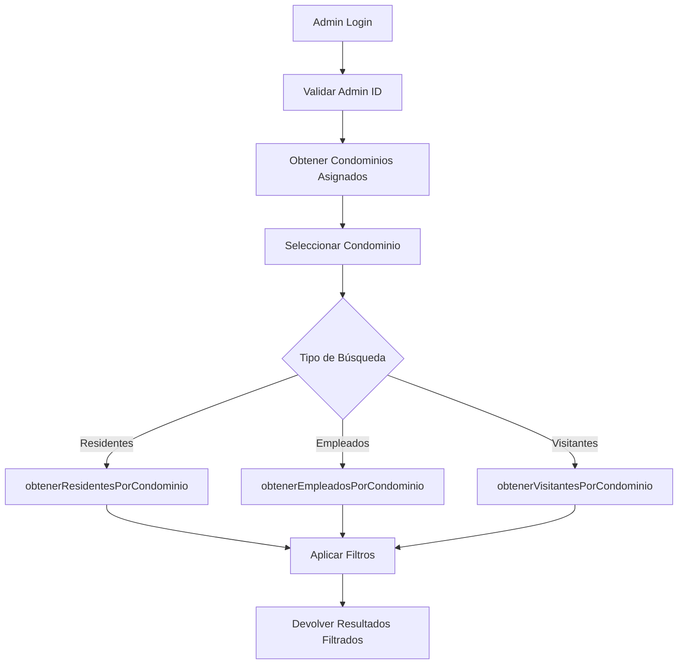
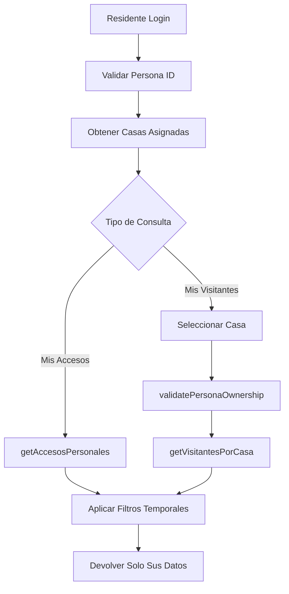

# 📊 DIAGRAMA UML ACTUALIZADO - SISTEMA CYBERHOLE CONDOMINIOS

## 🎯 PROPÓSITO DEL DOCUMENTO
Diagrama de clases UML ACTUALIZADO que refleja la estructura real de la base de datos con **ACCESO DIFERENCIADO** implementado. Incluye las nuevas funcionalidades de control de accesos por tipo de usuario y filtrado por condominio/propiedad.

---

## 🔍 ESPECIFICACIONES DE ACCESO DIFERENCIADO

### 👨‍💼 **ADMINISTRADORES**
- ✅ **Ver entradas/salidas de SUS PROPIOS condominios** (filtrado por condominio)
- ✅ **Búsquedas separadas:** Empleados, Visitantes y Residentes 
- ✅ **Control total** sobre empleados de sus condominios
- ✅ **Estadísticas** por condominio asignado

### 🏡 **RESIDENTES**
- ✅ **Ver visitantes que entraron a SUS PROPIAS propiedades** (filtrado por casa)
- ✅ **Ver sus propios accesos** (historial personal)
- ✅ **Gestión de visitantes** para su propiedad únicamente
- ✅ **Sin acceso** a datos de otros residentes

---

## 🎨 DIAGRAMA UML MERMAID - VERSIÓN ACTUALIZADA

```mermaid
classDiagram
    %% CLASE BASE ABSTRACTA
    class BaseModel {
        <<abstract>>
        -PDO connection
        -string table
        +connect() PDO
        +create(array data) int|false
        +findById(int id) array|null
        +update(int id, array data) bool
        +delete(int id) bool
        +findAll() array
        +validateRequiredFields(array data, array required) bool
        +logError(string message) void
        +sanitizeInput(mixed input) mixed
        +encryptData(string data) string
        +decryptData(string data) string
    }

    %% MODELOS ESPECÍFICOS
    class Admin {
        -string table = "admin"
        -string role = "ADMIN"
        +adminLogin(string email, string password) array|false
        +adminRegister(array data) int|false
        +findByEmail(string email) array|null
        +hashPassword(string password) string
        +validateEmailFormat(string email) bool
        +validatePasswordLength(string password) bool
        +getAllAdmins() array
        +assignAdminRole(int adminId) bool
        +getAdminRole() string
        +validateAdminCredentials(string email, string password) bool
        +getCondominiosAsignados(int adminId) array
    }
    
    class Condominio {
        -string table = "condominios"
        +createCondominio(array data) int|false
        +assignAdminToCondominio(int adminId, int condominioId) bool
        +removeAdminFromCondominio(int adminId, int condominioId) bool
        +getAdminsByCondominio(int condominioId) array
        +getCondominiosByAdmin(int adminId) array
        +validateAdminExists(int adminId) bool
        +validateAdminOwnership(int adminId, int condominioId) bool
    }
    
    class Calle {
        -string table = "calles"
        +findByCondominioId(int condominioId) array
        +validateCondominioExists(int condominioId) bool
        +validateNameUniqueInCondominio(string nombre, int condominioId) bool
    }
    
    class Casa {
        -string table = "casas"
        +createCasa(array data) int|false
        +findCasasByCalleId(int calleId) array
        +createClaveRegistro(array data) bool
        +findClaveRegistro(string codigo) array|null
        +markClaveAsUsed(string codigo) bool
        +assignPersonaToCasa(int personaId, int casaId) bool
        +getPersonasByCasa(int casaId) array
        +validateCalleExists(int calleId) bool
        +getCasasByResidente(int personaId) array
        +validateResidentOwnership(int personaId, int casaId) bool
    }
    
    class Persona {
        -string table = "personas"
        -string role = "RESIDENTE"
        +personaLogin(string email, string password) array|false
        +personaRegister(array data) int|false
        +findByCURP(string curp) array|null
        +findByEmail(string email) array|null
        +hashPassword(string password) string
        +validateCURPFormat(string curp) bool
        +validateEmailFormat(string email) bool
        +validateCURPUnique(string curp) bool
        +validateEmailUnique(string email) bool
        +assignResidenteRole(int personaId) bool
        +getResidenteRole() string
        +validatePersonaCredentials(string email, string password) bool
        +getCasasAsignadas(int personaId) array
    }
    
    class Tag {
        -string table = "tags"
        +findByPersonaId(int personaId) array
        +findByTagCode(string codigo) array|null
        +validateTagCodeUnique(string codigo) bool
        +validatePersonaExists(int personaId) bool
        +validateCasaExists(int casaId) bool
        +getTagsByResidente(int personaId) array
    }
    
    class Engomado {
        -string table = "engomados"
        +findByPersonaId(int personaId) array
        +findByPlaca(string placa) array|null
        +validatePlacaFormat(string placa) bool
        +validatePersonaExists(int personaId) bool
        +validateCasaExists(int casaId) bool
        +getEngomadosByResidente(int personaId) array
    }
    
    class Dispositivo {
        -string table = "personas_unidad"
        +createUnidad(array data) int|false
        +findUnidadByCURP(string curp) array|null
        +associateDispositivo(int unidadId, string tipo, int dispositivoId) bool
        +getDispositivosByUnidad(int unidadId) array
        +validateCURPUnique(string curp) bool
        +validateTipoDispositivo(string tipo) bool
        +getDispositivosByResidente(int personaId) array
    }
    
    class AreaComun {
        -string table = "areas_comunes"
        +createAreaComun(array data) int|false
        +findAreasComunesByCondominio(int condominioId) array
        +createReserva(array data) int|false
        +findReservasByAreaComun(int areaId) array
        +validateCondominioExists(int condominioId) bool
        +validateTimeFormat(string time) bool
        +getReservasByResidente(int personaId) array
    }
    
    class Blog {
        -string table = "blog"
        +findByAuthor(int adminId) array
        +validateAdminExists(int adminId) bool
        +validateVisibilityValue(string visibility) bool
        +getBlogsByCondominio(int condominioId) array
    }
    
    class Empleado {
        -string table = "empleados_condominio"
        -array encryptedFields = ["nombres", "apellido1", "apellido2", "puesto", "fecha_contrato"]
        +createEmpleado(array data) int|false
        +findEmpleadosByCondominio(int condominioId) array
        +createTarea(array data) int|false
        +findTareasByTrabajador(int trabajadorId) array
        +validateCondominioExists(int condominioId) bool
        +validatePuestoValue(string puesto) bool
        +findByAcceso(string idAcceso) array|null
        +toggleActivo(int id, bool activo) bool
        +validateIdAccesoUnique(string idAcceso, int excludeId) bool
        +encryptEmployeeData(array data) array
        +decryptEmployeeData(array data) array
        +getEmpleadosActivosByCondominio(int condominioId) array
    }

    class Acceso {
        -string tableResidentes = "accesos_residentes"
        -string tableEmpleados = "accesos_empleados" 
        -string tableVisitantes = "visitantes"
        
        %% MÉTODOS PARA ADMINISTRADORES - FILTRADO POR CONDOMINIO
        +obtenerResidentesPorCondominio(int condominioId, array options) array
        +obtenerEmpleadosPorCondominio(int condominioId, array options) array
        +obtenerVisitantesPorCondominio(int condominioId, array options) array
        +estadisticasPorCondominio(int condominioId, array options) array
        
        %% MÉTODOS PARA RESIDENTES - FILTRADO POR CASA/PERSONA
        +getAccesosPersonales(int personaId, array options) array
        +getVisitantesPorCasa(int casaId, array options) array
        +getHistorialPersonal(int personaId, int limite, int offset) array
        
        %% MÉTODOS DE REGISTRO DIFERENCIADO
        +registrarAccesoResidente(array data) int|false
        +registrarAccesoEmpleado(array data) int|false
        +registrarAccesoVisitante(array data) int|false
        
        %% MÉTODOS DE SALIDA
        +registrarSalidaResidente(int id) bool
        +registrarSalidaEmpleado(int id) bool
        +registrarSalidaVisitante(int id) bool
        
        %% MÉTODOS DE HISTORIAL CON PAGINACIÓN
        +historialResidente(int idPersona, int limite, int offset) array
        +historialEmpleado(int idEmpleado, int limite, int offset) array
        +historialVisitante(int idVisitante) array|null
        
        %% VALIDACIONES Y UTILIDADES
        +validateAccesoType(string tipo) bool
        +validatePersonaOwnership(int personaId, int casaId) bool
        +validateAdminOwnership(int adminId, int condominioId) bool
        +generateQRForVisitante(array visitanteData) string
        +validateQRCode(string qrCode) bool
    }

    %% HERENCIA DESDE BASEMODEL
    BaseModel <|-- Admin
    BaseModel <|-- Condominio
    BaseModel <|-- Calle
    BaseModel <|-- Casa
    BaseModel <|-- Persona
    BaseModel <|-- Tag
    BaseModel <|-- Engomado
    BaseModel <|-- Dispositivo
    BaseModel <|-- AreaComun
    BaseModel <|-- Blog
    BaseModel <|-- Empleado
    BaseModel <|-- Acceso

    %% RELACIONES DE BASE DE DATOS (FOREIGN KEYS)
    Admin ||--o{ Condominio : "admin_cond.id_admin"
    Condominio ||--o{ Calle : "calles.id_condominio"
    Calle ||--o{ Casa : "casas.id_calle"
    Casa ||--o{ Persona : "persona_casa.id_casa"
    Persona ||--o{ Casa : "persona_casa.id_persona"
    Persona ||--o{ Tag : "tags.id_persona"
    Persona ||--o{ Engomado : "engomados.id_persona"
    Persona ||--o{ Dispositivo : "personas_unidad.curp"
    Condominio ||--o{ AreaComun : "areas_comunes.id_condominio"
    Condominio ||--o{ Empleado : "empleados_condominio.id_condominio"
    Admin ||--o{ Blog : "blog.creado_por_admin"
    AreaComun ||--o{ AreaComun : "apartar_areas_comunes.id_area_comun"
    Empleado ||--o{ Empleado : "tareas.id_trabajador"
    
    %% NUEVAS RELACIONES DE ACCESO
    Persona ||--o{ Acceso : "accesos_residentes.id_persona"
    Casa ||--o{ Acceso : "accesos_residentes.id_casa"
    Empleado ||--o{ Acceso : "accesos_empleados.id_empleado"
    Condominio ||--o{ Acceso : "accesos_empleados.id_condominio"
    Casa ||--o{ Acceso : "visitantes.id_casa"

    %% ANOTACIONES DE RESPONSABILIDADES ACTUALIZADAS
    note for Admin "🔐 Gestiona: admin + LOGIN ADMIN + Control por Condominio"
    note for Condominio "🏢 Gestiona: condominios + admin_cond + Validación Ownership"
    note for Calle "🛣️ Gestiona: calles por condominio"
    note for Casa "🏠 Gestiona: casas + claves_registro + persona_casa + Ownership Residentes"
    note for Persona "👤 Gestiona: personas + LOGIN RESIDENTE + Consulta Casas vía Casa.php"
    note for Tag "🏷️ Gestiona: tags + Filtro por Residente"
    note for Engomado "🚗 Gestiona: engomados + Filtro por Residente"
    note for Dispositivo "📱 Gestiona: personas_unidad + persona_dispositivo + Dispositivos por Residente"
    note for AreaComun "🏊 Gestiona: areas_comunes + apartar_areas_comunes + Reservas por Residente"
    note for Blog "📝 Gestiona: blog + Publicaciones por Condominio"
    note for Empleado "👷 🔐 Gestiona: empleados_condominio + tareas + ENCRIPTACIÓN AES + Códigos Acceso"
    note for Acceso "🚪 🔐 CONTROL DIFERENCIADO: Residentes(por Casa) + Empleados(por Condominio) + Visitantes + Filtros"
```

---

## 📋 ASIGNACIÓN EXACTA DE MODELOS A TABLAS (ACTUALIZADA)

### 🔷 **MODELO → TABLA(S) ADMINISTRADA(S)**

| **MODELO** | **TABLA(S) PRINCIPAL(ES)** | **TABLA(S) SECUNDARIA(S)** | **TIPO DE GESTIÓN** | **CONTROL DE ACCESO** |
|------------|---------------------------|---------------------------|-------------------|----------------------|
| `BaseModel.php` | - | - | Abstracto (métodos comunes) | 🔐 Encriptación AES |
| `Admin.php` | `admin` | - | CRUD + LOGIN/REGISTRO ADMIN | 🏢 Por Condominio Asignado |
| `Condominio.php` | `condominios` | `admin_cond` | CRUD + relaciones | 🔐 Ownership Validation |
| `Calle.php` | `calles` | - | CRUD completo | 🏢 Por Condominio |
| `Casa.php` | `casas` | `claves_registro`, `persona_casa` | CRUD + relaciones | 🏠 Ownership por Residente |
| `Persona.php` | `personas` | - | CRUD + LOGIN/REGISTRO RESIDENTE | 🏠 Por Casa Asignada |
| `Tag.php` | `tags` | - | CRUD completo | 🏠 Por Residente |
| `Engomado.php` | `engomados` | - | CRUD completo | 🏠 Por Residente |
| `Dispositivo.php` | `personas_unidad` | `persona_dispositivo` | CRUD + relaciones | 🏠 Por Residente |
| `AreaComun.php` | `areas_comunes` | `apartar_areas_comunes` | CRUD + reservas | 🏢 Admin + 🏠 Residente |
| `Blog.php` | `blog` | - | CRUD completo | 🏢 Por Condominio |
| `Empleado.php` | `empleados_condominio` | `tareas`, `accesos_empleados` | 🔐 CRUD + AES + Códigos | 🏢 Por Condominio |
| `Acceso.php` | `accesos_residentes` | `accesos_empleados`, `visitantes` | 🔐 CONTROL DIFERENCIADO | 🏢 Admin + 🏠 Residente |

---

## 🔐 CONTROL DE ACCESO DIFERENCIADO - ESPECIFICACIONES

### 👨‍💼 **VISTA ADMINISTRADOR**

#### **Métodos Disponibles para Admins:**
```php
// FILTRADO POR SUS CONDOMINIOS ASIGNADOS
public function obtenerResidentesPorCondominio(int $condominioId, array $options = []): array
public function obtenerEmpleadosPorCondominio(int $condominioId, array $options = []): array  
public function obtenerVisitantesPorCondominio(int $condominioId, array $options = []): array

// ESTADÍSTICAS DE SUS CONDOMINIOS
public function estadisticasPorCondominio(int $condominioId, array $options = []): array

// VALIDACIÓN DE OWNERSHIP
public function validateAdminOwnership(int $adminId, int $condominioId): bool
```

#### **Restricciones de Admin:**
- ✅ **Solo SUS condominios:** No puede ver datos de condominios no asignados
- ✅ **Búsquedas separadas:** Residentes, Empleados y Visitantes por separado
- ✅ **Filtros temporales:** Por fecha, hora, tipo de acceso
- ❌ **Sin acceso:** A datos personales de residentes sin autorización

### 🏡 **VISTA RESIDENTE**

#### **Métodos Disponibles para Residentes:**
```php
// SUS PROPIOS ACCESOS
public function getAccesosPersonales(int $personaId, array $options = []): array
public function getHistorialPersonal(int $personaId, int $limite = 100, int $offset = 0): array

// VISITANTES DE SUS PROPIEDADES
public function getVisitantesPorCasa(int $casaId, array $options = []): array

// VALIDACIÓN DE OWNERSHIP
public function validatePersonaOwnership(int $personaId, int $casaId): bool
public function getCasasAsignadas(int $personaId): array
```

#### **Restricciones de Residente:**
- ✅ **Solo SUS propiedades:** No puede ver visitantes de otras casas
- ✅ **Solo SUS accesos:** Historial personal únicamente
- ✅ **Gestión de visitantes:** Solo para sus propiedades
- ❌ **Sin acceso:** A datos de otros residentes o empleados

---

## 🔄 FLUJOS DE CONTROL DE ACCESO

### 📊 **FLUJO ADMIN - CONSULTA DE ACCESOS**


### 📊 **FLUJO RESIDENTE - CONSULTA DE ACCESOS**


---

## ⚡ MÉTODOS PRINCIPALES ACTUALIZADOS POR MODELO

### 🔷 **Acceso.php - CONTROL DIFERENCIADO COMPLETO**

#### **Para Administradores (Filtrado por Condominio):**
```php
// CONSULTAS SEPARADAS POR TIPO DE USUARIO
public function obtenerResidentesPorCondominio(int $condominioId, array $options = []): array
public function obtenerEmpleadosPorCondominio(int $condominioId, array $options = []): array  
public function obtenerVisitantesPorCondominio(int $condominioId, array $options = []): array

// ESTADÍSTICAS ADMINISTRATIVAS
public function estadisticasPorCondominio(int $condominioId, array $options = []): array

// VALIDACIÓN DE PERMISOS
public function validateAdminOwnership(int $adminId, int $condominioId): bool
```

#### **Para Residentes (Filtrado por Casa/Persona):**
```php
// ACCESOS PERSONALES
public function getAccesosPersonales(int $personaId, array $options = []): array
public function getHistorialPersonal(int $personaId, int $limite = 100, int $offset = 0): array

// VISITANTES DE SUS PROPIEDADES
public function getVisitantesPorCasa(int $casaId, array $options = []): array

// VALIDACIÓN DE PERMISOS
public function validatePersonaOwnership(int $personaId, int $casaId): bool
```

#### **Métodos de Registro (Ambos Perfiles):**
```php
// REGISTRO DE ENTRADAS
public function registrarAccesoResidente(array $data): int|false
public function registrarAccesoEmpleado(array $data): int|false
public function registrarAccesoVisitante(array $data): int|false

// REGISTRO DE SALIDAS
public function registrarSalidaResidente(int $id): bool
public function registrarSalidaEmpleado(int $id): bool
public function registrarSalidaVisitante(int $id): bool
```

### 🔷 **Empleado.php - ENCRIPTACIÓN AES ACTUALIZADA**

#### **Métodos con Encriptación:**
```php
// CRUD CON ENCRIPTACIÓN AUTOMÁTICA
public function create(array $data): int|false              // 🔐 Encripta datos sensibles
public function findById(int $id): array|null               // 🔐 Desencripta automáticamente
public function update(int $id, array $data): bool          // 🔐 Re-encripta cambios

// NUEVOS MÉTODOS DE CONTROL
public function findByAcceso(string $idAcceso): array|null   // 🆕 Buscar por código físico
public function toggleActivo(int $id, bool $activo): bool    // 🆕 Activar/Desactivar
public function validateIdAccesoUnique(string $idAcceso, ?int $excludeId = null): bool

// FILTRADO POR CONDOMINIO
public function findEmpleadosByCondominio(int $condominioId, array $options = []): array
public function getEmpleadosActivosByCondominio(int $condominioId): array
```

### 🔷 **Casa.php - OWNERSHIP VALIDATION**
```php
// VALIDACIONES DE PROPIEDAD
public function validateResidentOwnership(int $personaId, int $casaId): bool
public function getCasasByResidente(int $personaId): array

// GESTIÓN DE PERSONAS
public function assignPersonaToCasa(int $personaId, int $casaId): bool
public function getPersonasByCasa(int $casaId): array
```

### 🔷 **Admin.php - CONDOMINIO MANAGEMENT**
```php
// GESTIÓN DE CONDOMINIOS
public function getCondominiosAsignados(int $adminId): array
public function validateAdminOwnership(int $adminId, int $condominioId): bool

// AUTENTICACIÓN ADMIN
public function adminLogin(string $email, string $password): array|false
public function validateAdminCredentials(string $email, string $password): bool
```

---

## 🎯 OPCIONES DE FILTRADO DISPONIBLES

### **Para Administradores:**
```php
$options = [
    'limite' => 100,                    // Límite de registros
    'activos_solamente' => true,        // Solo accesos sin salida
    'fecha_desde' => '2025-01-01',     // Filtro fecha desde
    'fecha_hasta' => '2025-12-31',     // Filtro fecha hasta
    'tipo_acceso' => 'entrada',        // entrada/salida
    'ordenar_por' => 'fecha_hora',     // Campo de ordenamiento
    'orden' => 'DESC'                  // Dirección de ordenamiento
];
```

### **Para Residentes:**
```php
$options = [
    'limite' => 50,                     // Límite menor para residentes
    'fecha_desde' => '2025-01-01',     // Filtro fecha desde
    'fecha_hasta' => '2025-12-31',     // Filtro fecha hasta
    'solo_mis_visitantes' => true,     // Solo visitantes autorizados por el residente
    'incluir_salidas' => false         // Solo entradas por defecto
];
```

---

## 🔒 VALIDACIONES DE SEGURIDAD

### **Validación de Ownership - Admin:**
```php
// Verificar que el admin puede acceder al condominio
if (!Acceso::validateAdminOwnership($adminId, $condominioId)) {
    throw new UnauthorizedException('No tienes permisos sobre este condominio');
}
```

### **Validación de Ownership - Residente:**
```php
// Verificar que el residente puede acceder a la casa
if (!Acceso::validatePersonaOwnership($personaId, $casaId)) {
    throw new UnauthorizedException('No tienes permisos sobre esta propiedad');
}
```

---

## 📊 RESUMEN DE ACTUALIZACIONES

### **✅ NUEVAS FUNCIONALIDADES IMPLEMENTADAS:**
1. **🔐 Control de Acceso Diferenciado** por tipo de usuario
2. **🏢 Filtrado por Condominio** para administradores
3. **🏠 Filtrado por Casa/Persona** para residentes
4. **🔐 Encriptación AES** en datos sensibles de empleados
5. **🆕 Códigos de acceso físico** para empleados
6. **📊 Sistema de paginación** para consultas grandes
7. **🔍 Búsquedas separadas** por tipo de acceso
8. **📈 Estadísticas** por condominio para admins
9. **👤 Historial personal** para residentes

### **🎯 BENEFICIOS DE SEGURIDAD:**
- **🛡️ Separación total** de datos por usuario
- **🔐 Validación de ownership** en todas las operaciones
- **📊 Logging automático** de accesos y consultas
- **⏱️ Control temporal** con filtros de fecha
- **🚫 Imposibilidad de acceso cruzado** entre condominios/casas

---

**📅 Actualizado:** 26 de Julio, 2025  
**🔄 Versión:** 3.0 - Diagrama con Control de Acceso Diferenciado + Encriptación AES  
**✅ Estado:** ESPECIFICACIÓN COMPLETA - Listo para implementación de UI/UX diferenciada
